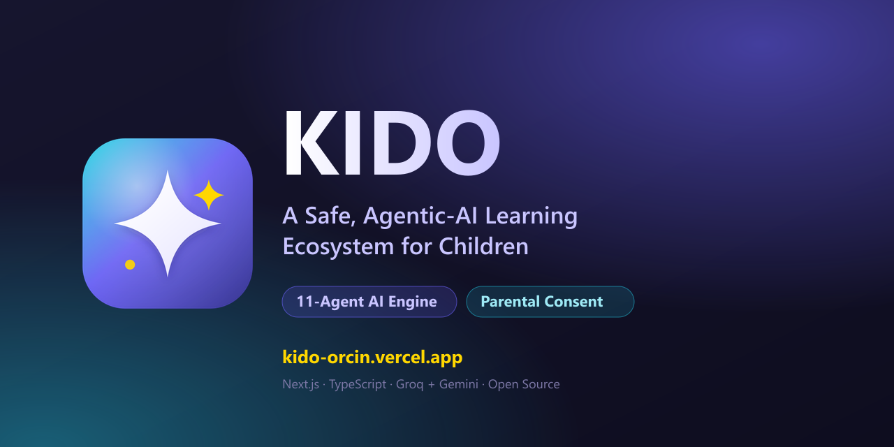
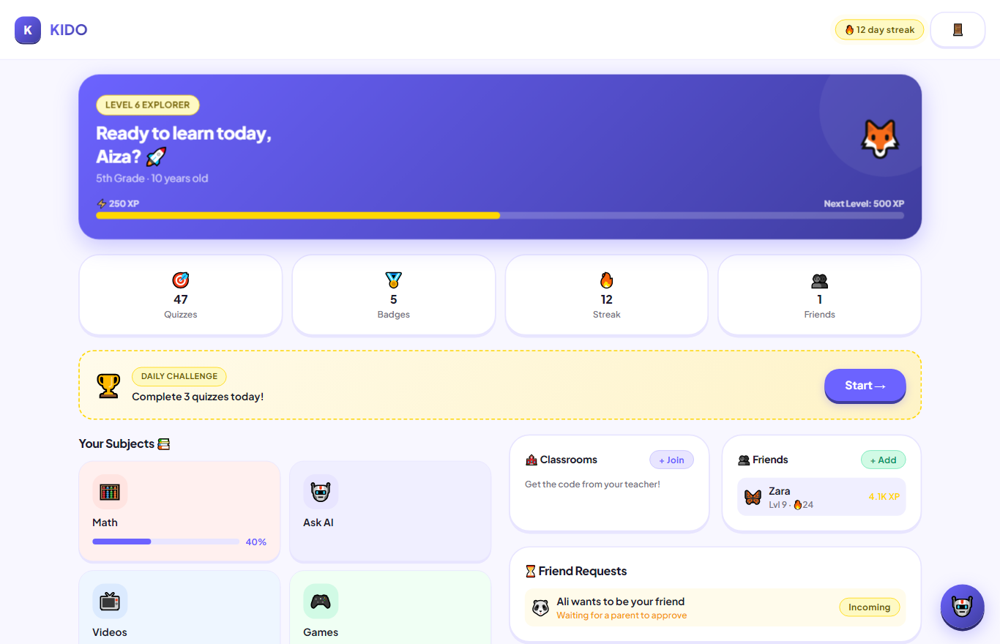
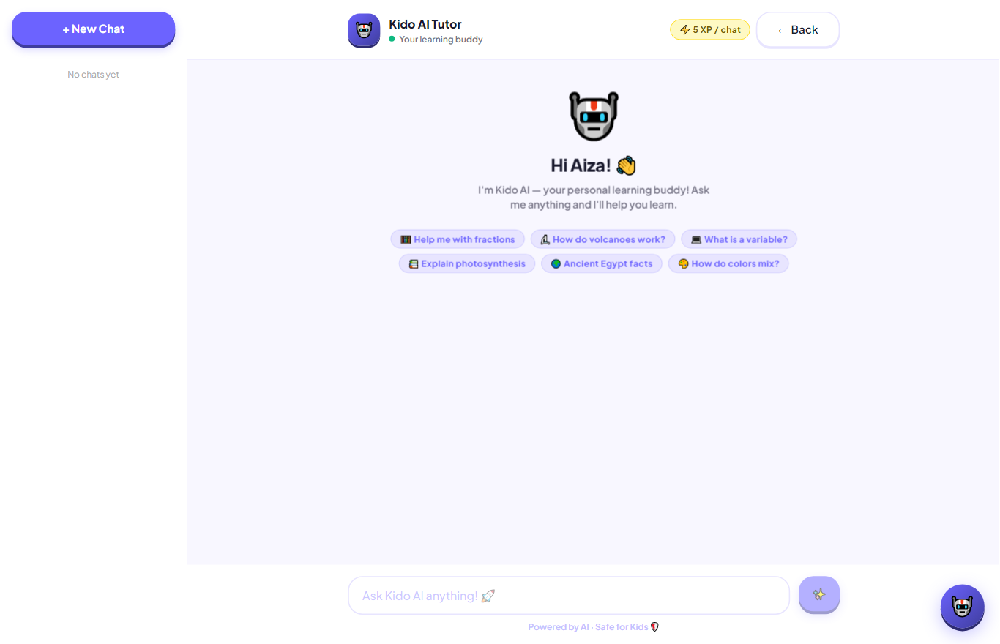
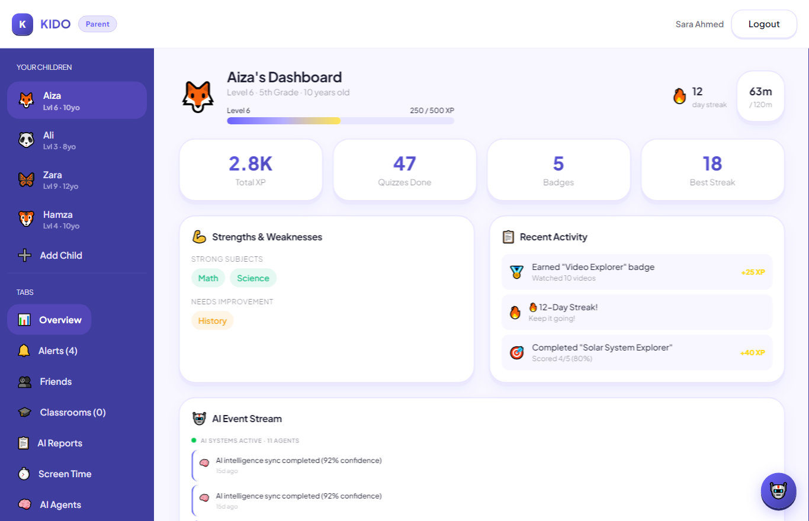
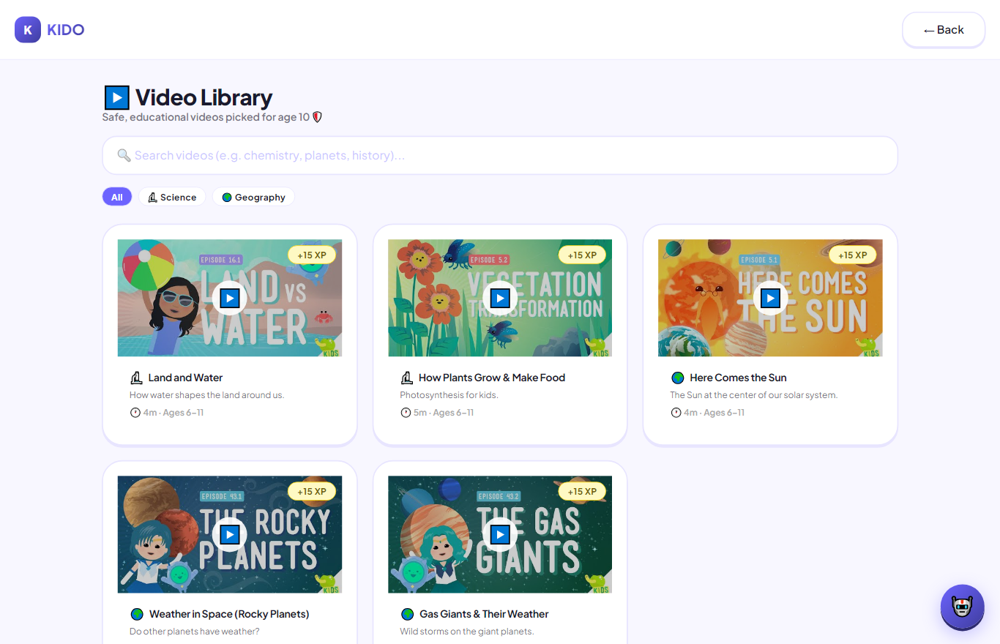

<div align="center">



# KIDO

### A Safe, Agentic-AI Learning Ecosystem for Children

*Personalized learning, parent-controlled safety, and an autonomous multi-agent AI — in one platform.*

[](https://kido-orcin.vercel.app)
&nbsp;
[](https://kido-orcin.vercel.app)


</div>

---

## 🌟 What is KIDO?

**KIDO** is a production-grade EdTech platform that makes learning **personalized, engaging, and provably safe** for children under 15. It blends gamified education (adaptive quizzes, an AI tutor, learning games, an age-gated video library) with an **autonomous multi-agent AI engine** that continuously analyzes each child and surfaces insights to parents and teachers — while **every social action is gated by verifiable parental consent**.

It is **live, deployed, and installable** as a web app, PWA, and Android APK.

> **The big idea:** most kids' apps optimize for screen time. KIDO optimizes for *learning outcomes* and *child safety* — and proves an AI system can be powerful **and** aligned with parental values.

<div align="center">




</div>

---

## ✨ Features

| | Feature | Description |
|---|---|---|
| 🧠 | **Agentic AI Engine** | 11 cooperating agents analyze learning, engagement, behavior & safety in real time |
| 💬 | **AI Tutor** | Multi-session, step-by-step, age-tuned — never just gives the answer |
| 📚 | **Adaptive Quizzes** | AI-generated; difficulty auto-scales to the child's level |
| 🎮 | **Learning Games** | Word, story & math challenges that reward XP |
| ▶️ | **Age-Gated Video Library** | Curated educational videos filtered to each child's age |
| 🏆 | **Gamification** | XP, levels, streaks, badges & leaderboards |
| 🛡️ | **Verifiable Parental Consent** | Friends & classrooms activate only after a parent approves |
| 👩‍🏫 | **Teacher Tools** | Classrooms with join codes, AI quiz generation, progress analytics |
| 📊 | **Role Dashboards** | Tailored experiences for Child, Parent, Teacher & Admin |

---

## 🧠 The Agentic AI Engine — what makes KIDO different

KIDO is **not a chatbot wrapper.** On each learning event it runs an autonomous reasoning loop:

```
OBSERVE → ANALYZE → DECIDE → ACT → LEARN
```

- **Tool-calling** — agents read the database, call the LLM, update XP/level, and raise parent alerts.
- **Planning** — an orchestrator decides which of the 11 agents run, sharing a common context.
- **Reflection** — a Contradiction-Detection agent catches conflicting signals, and a Fallback-Recovery agent guarantees a safe result if the AI fails.

Every run is persisted as an **explainable agent trace**. The AI layer is resilient by design — **Groq (Llama-3.3) → Gemini → curated content banks** — so it *never hard-fails*.

> See [`src/lib/agents.ts`](src/lib/agents.ts) for the full multi-agent pipeline.

---

## 🔐 Security & Child Safety (privacy-by-design)

- **Verifiable Parental Consent (VPC)** — a child cannot add friends or join a classroom without a parent's explicit approval.
- **Server-side authorization guard** — a single `getAccessibleChild()` gate on every child-scoped API; cross-account access returns `403`.
- **Age-gated content** — children only see age-appropriate material.
- **Data minimization** — only learning data is stored; no ads, no third-party trackers.
- **Secure auth** — JWT sessions + bcrypt-hashed passwords, role-based (parent / child / teacher / admin).

---

## 🏗️ Architecture

```
 Browser / PWA / Android TWA
        │
 Next.js 15 (App Router) ── Route Handlers (API) ── NextAuth (JWT, RBAC)
        │                          │
        │                    AI Engine ── Groq (Llama-3.3) → Gemini → fallback banks
        │                          │
        └────── Prisma ORM ──── PostgreSQL (Neon)
```

**Five layers:** Presentation → API Gateway → Business Logic → AI Engine → Data.

---

## 🛠️ Tech Stack

**Frontend** Next.js 15 · React 19 · Tailwind v4 · PWA
**Backend** Next.js Route Handlers · NextAuth v5 · Prisma ORM
**Database** PostgreSQL (Neon)
**AI** Groq `llama-3.3-70b` (primary) · Google Gemini `2.0-flash` (fallback)
**Auth** JWT · bcrypt · role-based access control
**DevOps** Vercel (CI/CD) · installable PWA + signed Android APK

---

## 🚀 Getting Started

```bash
git clone https://github.com/FarhanRajputFelix/KIDO.git
cd KIDO
npm install

# configure environment (see .env.example)
cp .env.example .env
#   DATABASE_URL   – PostgreSQL (Neon/Supabase)
#   AUTH_SECRET    – openssl rand -base64 32
#   GROQ_API_KEY   – free key from https://console.groq.com/keys
#   GEMINI_API_KEY – fallback, https://aistudio.google.com/apikey

npm run db:push        # apply schema
npm run db:seed        # optional demo data
npm run dev            # http://localhost:3000
```

**Demo logins:** `parent@kido.com / password123` · `teacher@kido.com / password123`

---

## 🗺️ Roadmap

- [x] Multi-agent AI engine with reflection & fallback
- [x] Verifiable parental consent for friends & classrooms
- [x] Age-gated video library, AI tutor, adaptive quizzes & games
- [x] Installable PWA + signed Android APK
- [ ] Native mobile clients (iOS/Android)
- [ ] Voice tutoring & computer-vision drawing feedback
- [ ] Richer analytics & parent insights dashboard
- [ ] Multi-language (Urdu) content

---

## 📈 Why it matters

EdTech for the next billion learners is **underserved on personalization and safety**. KIDO targets that gap with adaptive, gamified learning that keeps **parents in control** — a scalable, safety-first foundation for the South-Asian and global K-8 market.

> 📈 **Investors:** see the full brief — problem, market, *why now*, moat & ask — in **[INVESTORS.md](INVESTORS.md)**.

---

## 🤝 Contributing

Issues and PRs are welcome. Fork → branch → PR. Please keep changes focused and typed.

## 📄 License

[MIT](LICENSE) — built with ❤️ for safer, smarter learning.

<div align="center">

**[🌐 Live Demo](https://kido-orcin.vercel.app)** · Created & engineered by **Farhan**

</div>
