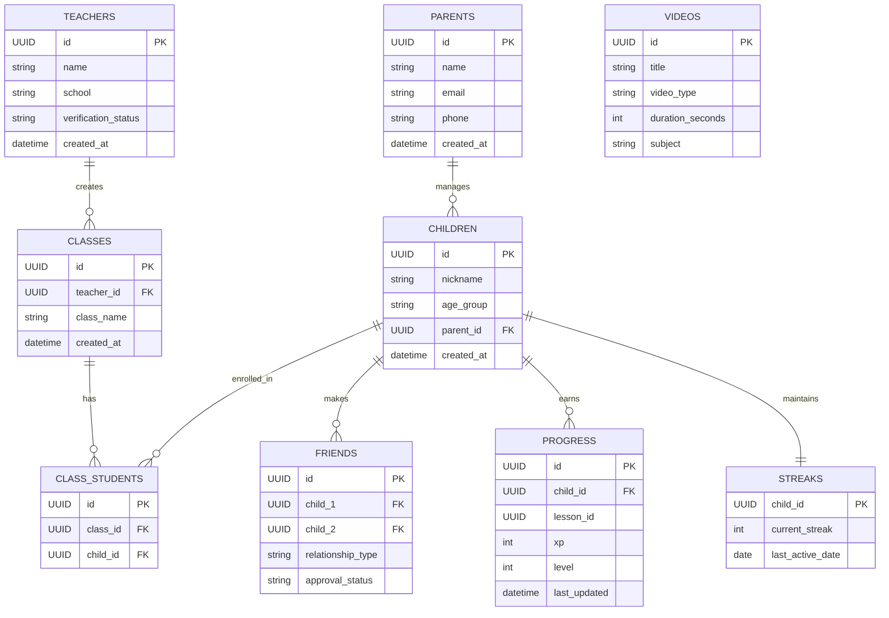

```mermaid
erDiagram
    PARENTS {
        UUID id PK
        string name
        string email
        string phone
        datetime created_at
    }

    CHILDREN {
        UUID id PK
        string nickname
        string age_group
        UUID parent_id FK
        datetime created_at
    }

    TEACHERS {
        UUID id PK
        string name
        string school
        string verification_status
        datetime created_at
    }

    CLASSES {
        UUID id PK
        UUID teacher_id FK
        string class_name
        datetime created_at
    }

    CLASS_STUDENTS {
        UUID id PK
        UUID class_id FK
        UUID child_id FK
    }

    FRIENDS {
        UUID id PK
        UUID child_1 FK
        UUID child_2 FK
        string relationship_type
        string approval_status
    }

    PROGRESS {
        UUID id PK
        UUID child_id FK
        UUID lesson_id
        int xp
        int level
        datetime last_updated
    }

    STREAKS {
        UUID child_id PK
        int current_streak
        date last_active_date
    }

    VIDEOS {
        UUID id PK
        string title
        string video_type
        int duration_seconds
        string subject
    }

    PARENTS ||--o{ CHILDREN : "manages"
    TEACHERS ||--o{ CLASSES : "creates"
    CLASSES ||--o{ CLASS_STUDENTS : "has"
    CHILDREN ||--o{ CLASS_STUDENTS : "enrolled_in"
    CHILDREN ||--o{ FRIENDS : "makes"
    CHILDREN ||--o{ PROGRESS : "earns"
    CHILDREN ||--|| STREAKS : "maintains"
```
