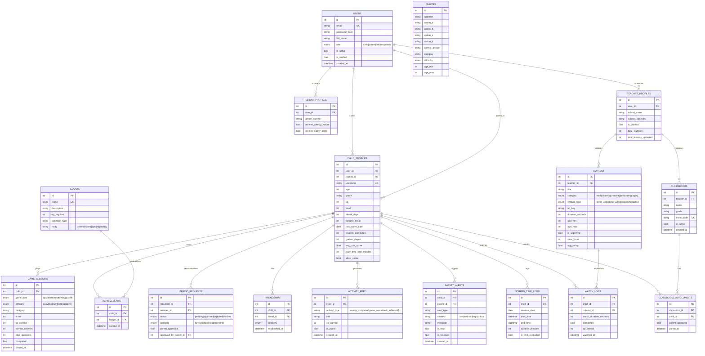

# 🗄️ KIDO Database Schema

```mermaid
erDiagram
    USERS {
        int id PK
        string email UK
        string password_hash
        string full_name
        enum role "child|parent|teacher|admin"
        bool is_active
        bool is_verified
        datetime created_at
    }

    CHILD_PROFILES {
        int id PK
        int user_id FK
        int parent_id FK
        string username UK
        int age
        string grade
        int xp
        int level
        int streak_days
        int longest_streak
        date last_active_date
        int lessons_completed
        int games_played
        float avg_quiz_score
        int daily_time_limit_minutes
        bool allow_social
    }

    PARENT_PROFILES {
        int id PK
        int user_id FK
        string phone_number
        bool receive_weekly_report
        bool receive_safety_alerts
    }

    TEACHER_PROFILES {
        int id PK
        int user_id FK
        string school_name
        string subject_specialty
        bool is_verified
        int total_students
        int total_lessons_uploaded
    }

    CONTENT {
        int id PK
        int teacher_id FK
        string title
        enum category "math|science|creativity|ethics|language|..."
        enum content_type "short_video|long_video|lesson|interactive"
        string url_key
        int duration_seconds
        int age_min
        int age_max
        bool is_approved
        int view_count
        float avg_rating
    }

    GAME_SESSIONS {
        int id PK
        int child_id FK
        enum game_type "quiz|memory|drawing|puzzle"
        enum difficulty "easy|medium|hard|adaptive"
        string category
        int score
        int xp_earned
        int correct_answers
        int total_questions
        bool completed
        datetime played_at
    }

    QUIZZES {
        int id PK
        string question
        string option_a
        string option_b
        string option_c
        string option_d
        string correct_answer
        string category
        enum difficulty
        int age_min
        int age_max
    }

    BADGES {
        int id PK
        string name UK
        string description
        int xp_required
        string condition_type
        string rarity "common|rare|epic|legendary"
    }

    ACHIEVEMENTS {
        int id PK
        int child_id FK
        int badge_id FK
        datetime earned_at
    }

    FRIEND_REQUESTS {
        int id PK
        int requester_id FK
        int receiver_id FK
        enum status "pending|approved|rejected|blocked"
        enum category "family|school|neighbor|other"
        bool parent_approved
        int approved_by_parent_id FK
    }

    FRIENDSHIPS {
        int id PK
        int child_id FK
        int friend_id FK
        enum category
        datetime established_at
    }

    ACTIVITY_FEED {
        int id PK
        int child_id FK
        enum activity_type "lesson_completed|game_won|streak_achieved|..."
        string title
        int xp_earned
        bool is_public
        datetime created_at
    }

    SAFETY_ALERTS {
        int id PK
        int child_id FK
        int parent_id FK
        string alert_type
        string severity "low|medium|high|critical"
        string message
        bool is_read
        bool is_resolved
        datetime created_at
    }

    SCREEN_TIME_LOGS {
        int id PK
        int child_id FK
        date session_date
        datetime start_time
        datetime end_time
        int duration_minutes
        bool is_limit_exceeded
    }

    CLASSROOMS {
        int id PK
        int teacher_id FK
        string name
        string grade
        string invite_code UK
        bool is_active
        datetime created_at
    }

    CLASSROOM_ENROLLMENTS {
        int id PK
        int classroom_id FK
        int child_id FK
        bool parent_approved
        datetime joined_at
    }

    WATCH_LOGS {
        int id PK
        int child_id FK
        int content_id FK
        int watch_duration_seconds
        bool completed
        int xp_earned
        datetime watched_at
    }

    USERS ||--o{ CHILD_PROFILES : "is child"
    USERS ||--o{ PARENT_PROFILES : "is parent"
    USERS ||--o{ TEACHER_PROFILES : "is teacher"
    CHILD_PROFILES }o--|| USERS : "parent_id"
    CHILD_PROFILES ||--o{ GAME_SESSIONS : "plays"
    CHILD_PROFILES ||--o{ ACHIEVEMENTS : "earns"
    CHILD_PROFILES ||--o{ FRIEND_REQUESTS : "sends/receives"
    CHILD_PROFILES ||--o{ FRIENDSHIPS : "has"
    CHILD_PROFILES ||--o{ ACTIVITY_FEED : "generates"
    CHILD_PROFILES ||--o{ SAFETY_ALERTS : "triggers"
    CHILD_PROFILES ||--o{ SCREEN_TIME_LOGS : "logs"
    CHILD_PROFILES ||--o{ WATCH_LOGS : "watches"
    CHILD_PROFILES ||--o{ CLASSROOM_ENROLLMENTS : "enrolls"
    TEACHER_PROFILES ||--o{ CONTENT : "uploads"
    TEACHER_PROFILES ||--o{ CLASSROOMS : "manages"
    CLASSROOMS ||--o{ CLASSROOM_ENROLLMENTS : "has"
    CONTENT ||--o{ WATCH_LOGS : "tracked via"
    BADGES ||--o{ ACHIEVEMENTS : "awarded via"
```
