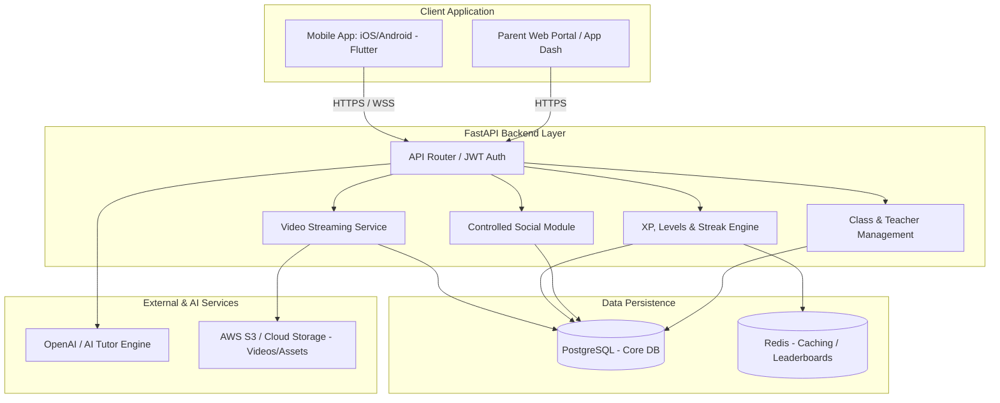

```mermaid
graph TD
    %% Core Mobile App layer
    subgraph Client Application
        FlutterApp[Mobile App: iOS/Android - Flutter]
        ParentDashboard[Parent Web Portal / App Dash]
    end

    %% API Gateway / Middleware
    subgraph Backend Services [FastAPI Backend Layer]
        API_Gateway[API Router / JWT Auth]
        VideoService[Video Streaming Service]
        GamificationService[XP, Levels & Streak Engine]
        SocialService[Controlled Social Module]
        SchoolService[Class & Teacher Management]
    end

    %% Database & Cache
    subgraph Data Persistence
        PostgreSQL[(PostgreSQL - Core DB)]
        Redis[(Redis - Caching / Leaderboards)]
    end

    %% AI / External Integrations
    subgraph External & AI Services
        OpenAI[OpenAI / AI Tutor Engine]
        CloudStorage[AWS S3 / Cloud Storage - Videos/Assets]
    end

    %% Connections
    FlutterApp --> |HTTPS / WSS| API_Gateway
    ParentDashboard --> |HTTPS| API_Gateway

    API_Gateway --> VideoService
    API_Gateway --> GamificationService
    API_Gateway --> SocialService
    API_Gateway --> SchoolService

    VideoService --> CloudStorage
    VideoService --> PostgreSQL
    
    GamificationService --> PostgreSQL
    GamificationService --> Redis
    
    SocialService --> PostgreSQL
    SchoolService --> PostgreSQL

    API_Gateway --> OpenAI
```
