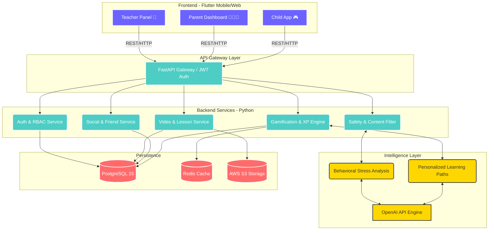

# KIDO System Architecture

## System Components Explained

### 1. Client Layer (Flutter)
- **Child App:** Optimized for low latency interaction, heavy gamification loops, animations (Lottie/Canvas).
- **Parent Dashboard:** Analytical view with graphs for screen-time, detailed logs.
- **Teacher Panel:** Video upload queue, student metric tracking.

### 2. Core Backend (FastAPI)
- Uses asynchronous I/O to handle thousands of concurrent game clicks.
- JWT Role Based Access Control restricts routes so children cannot hit parent endpoints.
- **Safety Engine:** Runs middleware on every request checking timeout limits (Screen Time) before serving payloads.

### 3. AI Intelligence Layer
- Periodically scans user logs in the background.
- Employs behavioral heuristics mapping to adaptively adjust quiz difficulty.

### 4. Persistence Layer
- **PostgreSQL:** Primary relational database holding 16 interconnected normalized tables ensuring absolute consistency for financial/safety records.
- **Redis:** Volatile caching for Leaderboard ranking to avoid heavy DB scans, and tracking active sessions.
- **S3 Object Storage:** Scalable binary storage for streaming encrypted, ad-free educational video content.
